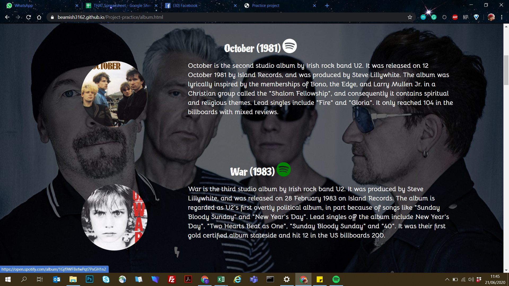
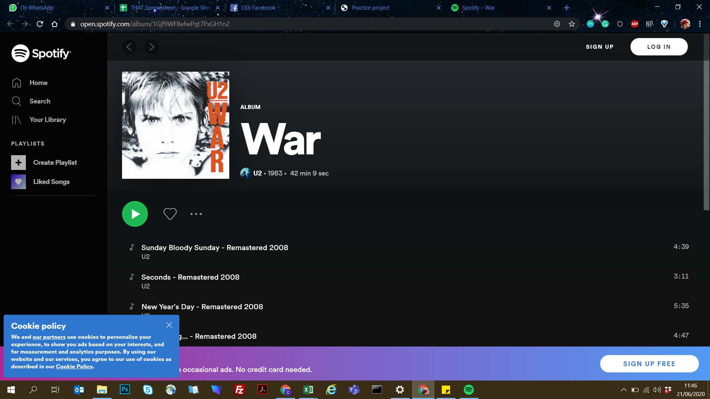
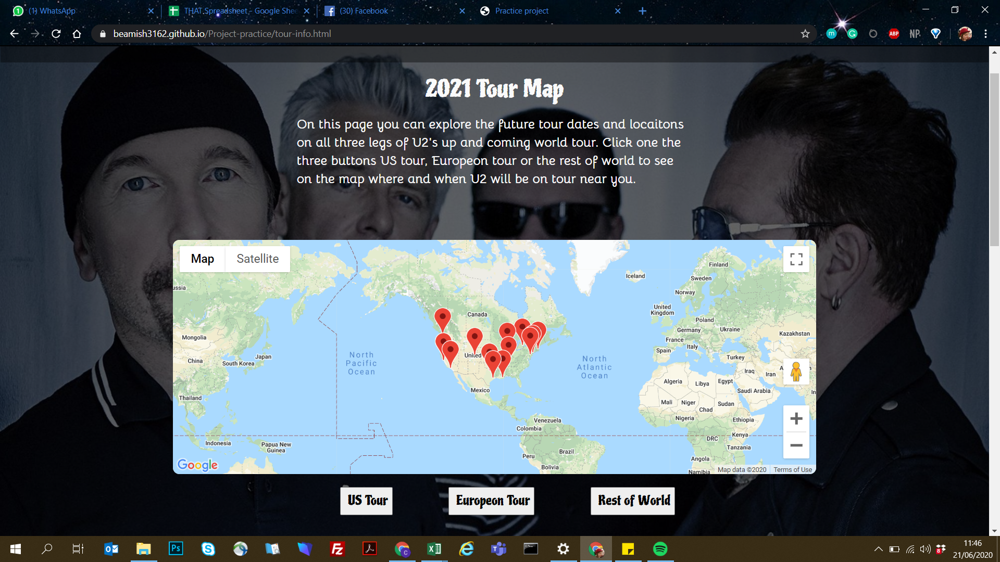

# U2 Fan page

This is a page dedicated to U2 the Irish band and is designed to provide fun info on the band for anyone who enjoys their music and
wants to learn more about the band members, how they got started, tour information or any info about their 14 studio albums. The general goal 
of the website is to provide information and access to that informaiton to all fans. It is worth noting that the tour info provided is fictional 
as due to the pandemic all tours are cancelled. Content can be changed to relfect real tour dates and locations in the future. 

a user would expect to be able to find good informaiton on the bands work aswell as access to those work 

## a)

Through the spotify links on th page users access the music 

## b)

A user will be able to access google maps which will provide them the ability to visally see where the concerts will be taking place. They can interacte with the world map to access the information provided

## Strategy
The strategy is to provide information on everything  U2 including their up and coming tour as well albums released in the past and 
just general facts. The objective is to provide a fan with access to information they may desire about the band and links to access music, tour info and where to purchase tickets. 

## Scope
Below is a breakdown wha tthe user can expect on each page for features and content.

The **Landing page** provides the user with an intro to the page with an in text navagation option to the tour info page. The user can learn information about how the band started, what awards and honors 
the band has won and finally info on the band's four members. There are also relevent images accompanying all of this info. This page aswell as all pages are linked to 

The **Album page** breaks down all the bands albums, providing album cover images, general info, billboard 200 spots and also links to each albums spotify page. We feel this gives a guide of albusm thorugh the years 
with easy access to the music aswell.

the **Tour page** gives the user an interactive google map which shows location and dates for the bands up and coming world tour. Three buttons let the user switch between displaying 
the three legs of the tour the S tour, Europeon tour and the rest of world tour. Info bubbles help users investigate locations on the map while tables below help display all the info at once below the map. 
Also a link to ticketmaster appears below the table to give the user the option to purchase tickets to the event. (for the purpose of this project it jsut goes to ticket master/u2 as there is no tour info to link it to.)

## Structure
The page has a header, slightly transperant, with a navbar tight to the left. Aswell as  on the landing page their is a link to tour page in the introduction paragrapgh. All pages have a footer 
aswell with a quote from one of the band members and links to their social media pages.

## Skeleton 
In this project the Skeleton changed drastically from the original wireframes bar maybe the tour information page. the original wireframes have been attached aswell as an 
explination as to why they had changed.

[Landing-page](assets/wireframes/Landing-page.pdf) - On this page the layout is similar to the oroignal idea just addition of content such as "how it started" and "achievements" but the layout 
did not change drastically. As in all three pages the footer was not included in the origianl wireframe but was added later.

[Album-page](assets/wireframes/album-page.pdf)  - This page completely changed form the oroignal idea. It was supposed to be a quiz but due to time constraints and a feeling that their was too much content on the landing page, 
this page was changed to the album page. The content became album info and links to spotify for the albums. 

## Surface
Used a hero-image common to all pages  with a 0.6 transpernacy so ont to overwelm the rest of the content. 

## Features 
The main feature is the use of the google maps api to give the user the ability to see a map of U2's up and coming world tour. In this feature the user can change between a view of the three different 
legs of the tour with three different button options. An example would be clicking on the Europeon tour button would display all locations on the map and a list of those locations below with stadium name, 
city and date. Aswell as this on the album page 

**Future features** we would look to include:

  **1)**  Was looking to make a quiz about the band but decided against it with time constraints due to the fact other features took longer to complete then expected.  

## Technologies
1) html
2) CSS 
3) Javascript
4) bootstrap 4.4.1
5) google api 

## Testing
Tests where done accross multiple search engines including google chrome, Firefox and internet explorer. The responsiveness of all pages where tested on each search engine at the iphone 6/7/8, ipad
 on both rotations and of coarse desktop. Links to social media in the footer and links to spotify worked on all platforms aswell as on all screen sizes. The buttons tha interact with the google maps 
 worked on all paltfomrs and sizes, the info windows hover option on the maps itself where not available on iphone obviously but ohter then that the infowindows worked. 
 Had trouble with the table function working correctly but was fixed and worked on all screen sizes and browsers. 

## Deployment 
Commit the project on gitpod with regular git pushes to github, the host website. Should be no difference form the deployment version or the development. 

## Credits/Media
*All content on U2 image wise and 90% of info came from various wikipedia pages on the band, its memebers and albums. The link to the main U" page is linked [here](https://en.wikipedia.org/wiki/U2). 
We have not provided all the links to wikipedia pages for the 14 albums or 4 band members but all images came directly form those pages. 
*The olny exception to this was the hero image which came from the Grammy's website which is linked [here](https://www.grammy.com/sites/com/files/styles/image_landscape_hero/public/muzooka/U2/U2_16_9_1578385237.jpg?itok=zqBgR15h)

## Acknowledgements 
 * W3s school was leaned on heavily for helping put together this website especially the navbar and footer. A link to their website is [here](https://www.w3schools.com/default.asp) 
 * Stack Overflow was also a tool used for info especially sorting out general bugs and gltiches throughout the project [here](https://stackoverflow.com/)
 * Youtube channel Framework Television was used to get started with the google api and generally inspired the original javascript before refactoring was done. the link to 
 the video I used is [here](https://www.youtube.com/watch?v=8NUqDc1bQ84)
 * stackflow page where i directly took a funciton for the button opening content in a new tab, link provided [here](https://stackoverflow.com/questions/34082002/html-button-opening-link-in-new-tab/46542656)
 * google maps api documentation was used, link provided [here](https://developers.google.com/maps/documentation/javascript/markers)
